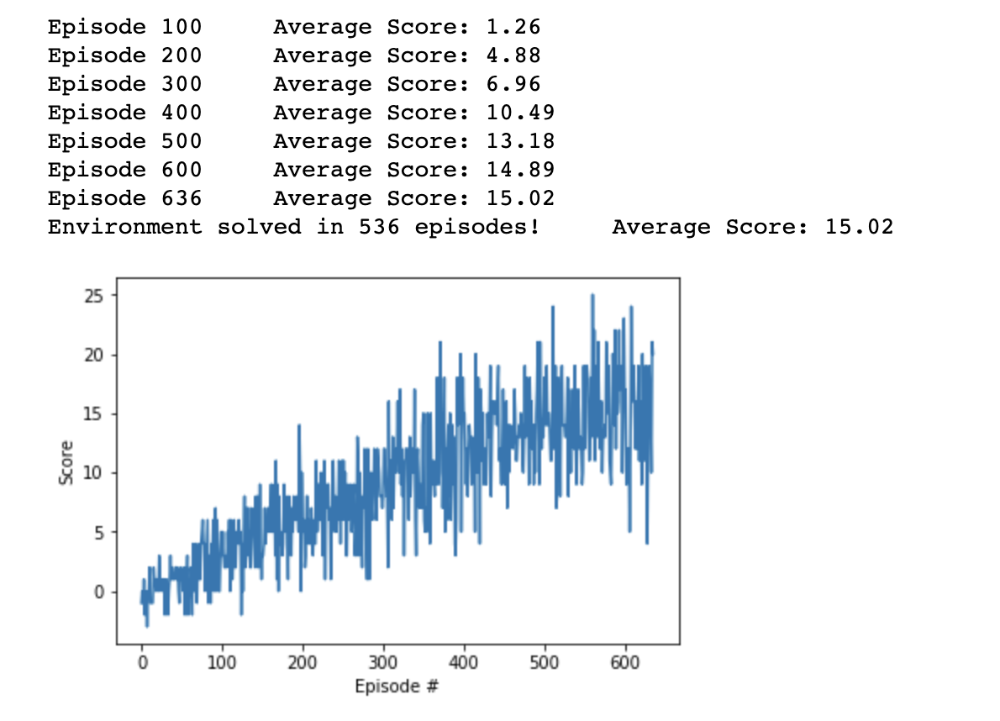

# Project report for Udacity's Deep Reinforcement Learning based Navigation project

## Overview and Implementation

The goal of this project was to train an agent to navigate a unity environment - Banana Collector, collecting yellow bananas while avoiding blue bananas. 
The task is episodic and there are 37 different state space dimensions with 4 different possible actions. 
Rewards of +1 are accumulated when a yellow banana is collected and -1 when a blue banana is picked up. There are no rewards or penalties for moving. 

For the current implementation, we consider the task to be learned successfully if we managed to achieve an average score of 15 or more for past 100 episodes.


## Learning algorithm

The solution implemented is Deep Q-Learning (DQN) algorithm.


### Model architecture
 

The final solution used two hidden layers- each of 64 neurons. 
Input layer has dimension same as the state size (37 in this case) and the output layer has the size same as the action size (4 in this case).

```
QNetwork(
  (fc1): Linear(in_features=37, out_features=64, bias=True)
  (fc2): Linear(in_features=64, out_features=64, bias=True)
  (out): Linear(in_features=64, out_features=4, bias=True)
)
```

### Hyper-Parameters

These were the hyper-parameters used to train the agent for above results.
```
BUFFER_SIZE = int(1e5)  # replay buffer size
BATCH_SIZE = 64         # minibatch size
GAMMA = 0.99            # discount factor
TAU = 1e-3              # for soft update of target parameters
LR = 5e-4               # learning rate 
UPDATE_EVERY = 4        # how often to update the network
```

## Results

The problem was solved in 536 episodes with an average score of 15.02




## Ideas for future work
 
We can explore the implementation of the better DQNs such as Duelling DQN. Additionally, the improvements to sampling in replay-buffer can be explored.


